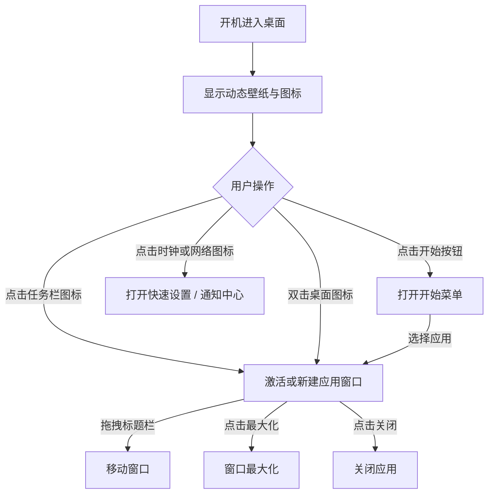

# CoolSpanOS - 产品需求文档 (PRD)

## 1. 产品概述

CoolSpanOS 是一款基于 Web 技术栈（React + TypeScript）仿照 Windows 11 视觉语言实现的桌面操作系统模拟前端，专注还原现代操作系统的亚克力材质（Mica / Acrylic）、居中式任务栏、流畅的动效以及亚像素级平滑字体渲染。

- 主要用途：作为新系统项目 CoolSpanOS 的可视化外壳 / 启动台，演示桌面、开始菜单、动态壁纸、可拖拽窗口等核心体验。
- 目标用户：希望快速搭建「类 Windows 11」演示前端、UI 探索或系统教学原型的开发者与设计师。

## 2. 核心功能

### 2.1 用户角色
本项目为前端展示型系统原型，暂不涉及账号系统。

| 角色 | 入口 | 核心权限 |
|------|------|----------|
| 访客用户 | 进入桌面 | 浏览所有应用、切换壁纸、打开窗口、调整音量 / 网络占位面板 |

### 2.2 功能模块
1. **桌面 (Desktop)**：动态壁纸层 + 桌面图标网格 + 全局亚克力效果
2. **任务栏 (Taskbar)**：居中布局 · 启动器 / 搜索 / 任务视图 / 应用托盘 / 系统托盘（时钟、通知、电源）
3. **开始菜单 (Start Menu)**：固定应用、推荐项目、用户头像、电源按钮
4. **应用窗口 (Window)**：可拖拽、最大化 / 最小化 / 关闭、毛玻璃标题栏、内嵌示例内容
5. **系统通知 / 快速设置面板 (Quick Settings)**：右下角飞出，Wi-Fi / 蓝牙 / 飞行模式 / 亮度 / 音量等
6. **字体渲染与可访问性**：开启 ClearType 风格的亚像素抗锯齿、`font-smoothing: antialiased`，全场景应用

### 2.3 页面 / 模块详情
| 页面 / 模块 | 名称 | 功能描述 |
|-------------|------|----------|
| 桌面 | 壁纸层 | 全屏动态渐变 + 噪点纹理，可随时间缓慢流动 |
| 桌面 | 图标 | 支持单击选中 / 双击打开应用窗口 |
| 任务栏 | 居中 Dock | 启动器、搜索、任务视图、应用托盘、系统托盘 |
| 开始菜单 | 网格 + 推荐 | 固定应用 6×N 网格、推荐文件列表、电源按钮 |
| 应用窗口 | 通用 Window | 标题栏、控件按钮、内容区，支持拖动 |
| 快速设置 | Flyout | 右下角弹出，亮度 / 音量 / 网络开关 |
| 通知中心 | Action Center | 右下角日历 + 通知列表 |

## 3. 核心流程

## 4. 用户界面设计

### 4.1 设计风格
- **主色板**：
  - 系统强调色：`#0078D4`（Windows Blue）
  - 任务栏 / Mica 半透明：`rgba(32, 32, 32, 0.6)` + `backdrop-filter: blur(40px) saturate(180%)`
  - 文字主色：`#FFFFFF` / `rgba(255,255,255,0.9)`；副文字 `rgba(255,255,255,0.6)`
- **按钮 / 控件**：8px 圆角胶囊按钮，hover / pressed 状态使用半透明叠加层
- **字体**：
  - UI 主字体：`"Segoe UI Variable", "Segoe UI", "PingFang SC", "Microsoft YaHei", system-ui`
  - 启用 `-webkit-font-smoothing: antialiased` / `-moz-osx-font-smoothing: grayscale` / `text-rendering: optimizeLegibility`
  - 标题使用 600 权重，正文 400 权重，关键数字使用 `font-feature-settings: "tnum"`
- **布局**：顶部状态条 + 底部居中任务栏；窗口采用浮动分层
- **图标风格**：使用 `lucide-react` 线性图标，统一 20px 描边

### 4.2 页面设计概览
| 模块 | UI 元素 |
|------|---------|
| 桌面壁纸 | 多层径向渐变 + 噪点 + 缓慢位移 |
| 任务栏 | 半透明深色条，圆角矩形 dock，居中布局，hover 出现轻量背景 |
| 开始菜单 | 居中弹出卡片，亚克力背景，固定应用 6 列网格 |
| 应用窗口 | 圆角 8px、标题栏 32px、毛玻璃内容区 |
| 快速设置 | 右下角 flyout 卡片，开关使用 Fluent 风格 toggle |

### 4.3 响应式
- 桌面优先（≥ 1280px），向下兼容至 1024px
- 触摸设备自动放大命中区至 44×44

### 4.4 动效与质感
- 全部交互使用 `cubic-bezier(0.16, 1, 0.3, 1)` 缓动
- 任务栏应用激活指示条使用 `::after` + transform 动画
- 启动 / 关闭窗口使用 opacity + scale 200ms 过渡
