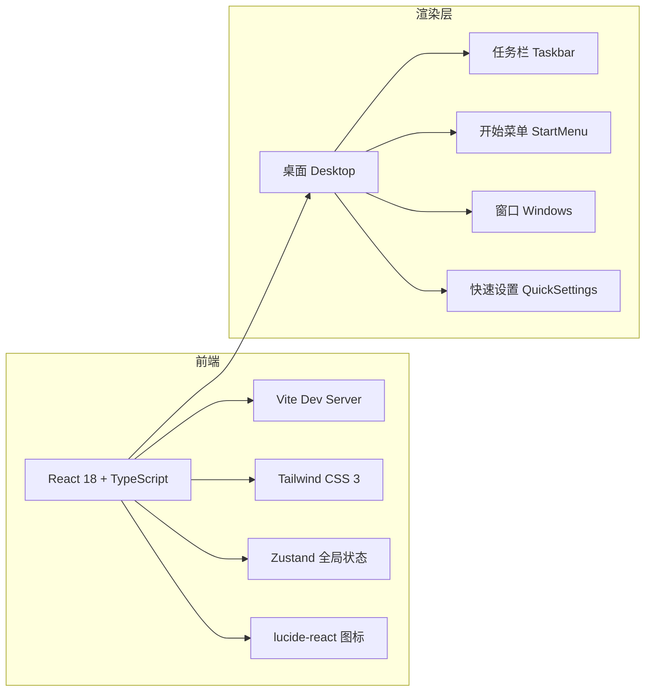

# CoolSpanOS - 技术架构文档

## 1. 架构设计



> 本项目为纯前端原型，无后端服务。

## 2. 技术栈

- **构建工具**：Vite 5
- **框架**：React@18 + TypeScript@5
- **样式**：Tailwind CSS@3 + CSS 变量 + 自定义 `backdrop-filter`
- **状态管理**：Zustand（管理窗口列表、开始菜单、通知中心等全局开关）
- **图标**：`lucide-react`
- **字体平滑**：通过全局 CSS 启用 `font-smoothing: antialiased` / `text-rendering: optimizeLegibility` / `font-feature-settings: "ss01", "tnum"`

## 3. 路由定义

| 路由 | 用途 |
|------|------|
| `/` | 单页入口，渲染 CoolSpanOS 桌面 |

> 当前阶段为单页面应用，路由由 React Router 保留扩展位。

## 4. 组件结构

```
src/
├── App.tsx
├── main.tsx
├── index.css                    # 全局字体平滑 + 亚克力工具类
├── store/
│   └── useOSStore.ts            # zustand: 窗口、菜单、通知状态
├── components/
│   ├── Desktop/
│   │   ├── Desktop.tsx          # 桌面容器（壁纸 + 图标）
│   │   └── Wallpaper.tsx        # 动态壁纸
│   ├── Taskbar/
│   │   ├── Taskbar.tsx          # 底部任务栏
│   │   ├── StartButton.tsx
│   │   ├── SearchButton.tsx
│   │   ├── TaskViewButton.tsx
│   │   ├── SystemTray.tsx       # 时钟 / 网络 / 音量 / 电源
│   │   └── PinnedApps.tsx
│   ├── StartMenu/
│   │   ├── StartMenu.tsx
│   │   ├── PinnedApps.tsx
│   │   └── Recommended.tsx
│   ├── Window/
│   │   ├── Window.tsx           # 通用窗口（拖拽 / 最大化 / 关闭）
│   │   └── WindowControls.tsx
│   ├── QuickSettings/
│   │   └── QuickSettings.tsx
│   ├── ActionCenter/
│   │   └── ActionCenter.tsx
│   └── common/
│       ├── AcrylicPanel.tsx     # 亚克力面板
│       └── Toggle.tsx
└── utils/
    └── animations.ts            # 缓动 / 时间常量
```

## 5. 关键实现

- **亚克力 / Mica**：`backdrop-filter: blur(40px) saturate(180%) brightness(110%)` + 半透明深色背景
- **字体平滑**：在 `index.css` 中统一开启 `font-smoothing: antialiased`、`text-rendering: optimizeLegibility`，并对中英文字体分别声明 fallback
- **窗口拖拽**：使用原生 `pointerdown / pointermove / pointerup`，约束在桌面区域内
- **任务栏激活态**：每个 dock icon 使用 `::after` 短下划线表示活跃窗口

## 6. 性能与可访问性

- 首次进入时壁纸动画自动暂停（`prefers-reduced-motion`）
- 窗口内容懒加载（按需 import）
- 颜色对比度满足 WCAG AA 文本规范
- 全局快捷键：`Win` 打开开始菜单，`Esc` 关闭浮层
